[TOC]

------


##  Docker安装

#### Docker的基本组成

镜像（image）：

docker镜像就像一个容器，可以通过这个模板创建容器服务，通过这个镜像可以创建多个容器（最终服务或者项目运行就是在容器中）。

容器（container）：

Docker利用容器技术，独立运行一个或者一组应用，，通过镜像来创建的。

启动，停止，删除是基本命令。

目前可以把容器理解成一个简易的Linux系统。

仓库（repository）：

仓库就是存放镜像的地方。

仓库分为公有和私有仓库。

#### 安装Docker

> 环境准备（CentOS7）
>
> #3.10以上
>
> [root@VM-0-14-centos ~]# uname -r
> 3.10.0-862.el7.x86_64

> 环境安装
>
> https://docs.docker.com/engine/install/centos/

1、卸载旧版本的docker

```shell
$ sudo yum remove docker \
                  docker-client \
                  docker-client-latest \
                  docker-common \
                  docker-latest \
                  docker-latest-logrotate \
                  docker-logrotate \
                  docker-engine
```

2、通过仓库安装

```shell
$ sudo yum install -y yum-utils
```

3、设置镜像仓库

```shell
# 国外的，不推荐使用
$ sudo yum-config-manager \
    --add-repo \
    https://download.docker.com/linux/centos/docker-ce.repo
# 阿里云的，推荐使用
$ sudo yum-config-manager \
    --add-repo \
    https://mirrors.aliyun.com/docker-ce/linux/centos/docker-ce.repo
```

更新软件包索引（可选）：

```shell
$ sudo yum makecache fast
```

4、安装docker引擎

```shell
$ sudo yum install docker-ce docker-ce-cli containerd.io
```

5、启动docker

```shell
$ systemctl start docker
$ docker version
Client:
 Version:       17.12.0-ce
 API version:   1.35
 Go version:    go1.9.2
 Git commit:    c97c6d6
 Built: Wed Dec 27 20:10:14 2017
 OS/Arch:       linux/amd64

Server:
 Engine:
  Version:      17.12.0-ce
  API version:  1.35 (minimum version 1.12)
  Go version:   go1.9.2
  Git commit:   c97c6d6
  Built:        Wed Dec 27 20:12:46 2017
  OS/Arch:      linux/amd64
  Experimental: false
```

6、测试

```shell
$ docker run hello-world
Unable to find image 'hello-world:latest' locally  # 不存在hello-world 自动拉取
latest: Pulling from library/hello-world
0e03bdcc26d7: Pull complete 
Digest: sha256:8c5aeeb6a5f3ba4883347d3747a7249f491766ca1caa47e5da5dfcf6b9b717c0
Status: Downloaded newer image for hello-world:latest

Hello from Docker! # 成功
This message shows that your installation appears to be working correctly.

To generate this message, Docker took the following steps:
 1. The Docker client contacted the Docker daemon.
 2. The Docker daemon pulled the "hello-world" image from the Docker Hub.
    (amd64)
 3. The Docker daemon created a new container from that image which runs the
    executable that produces the output you are currently reading.
 4. The Docker daemon streamed that output to the Docker client, which sent it
    to your terminal.

To try something more ambitious, you can run an Ubuntu container with:
 $ docker run -it ubuntu bash

Share images, automate workflows, and more with a free Docker ID:
 https://hub.docker.com/

For more examples and ideas, visit:
 https://docs.docker.com/get-started/
```

7、查看hello-world镜像是否存在

```shell
$ docker images
REPOSITORY          TAG                 IMAGE ID            CREATED             SIZE
hello-world         latest              bf756fb1ae65        10 months ago       13.3kB
```

8、卸载docker

```shell
# 1、卸载依赖
$ sudo yum remove docker-ce docker-ce-cli containerd.io
# 2、删除资源
$ sudo rm -rf /var/lib/docker
```

**阿里云镜像加速**

1、登陆阿里云找到容器服务


#### 回顾hello-werld流程

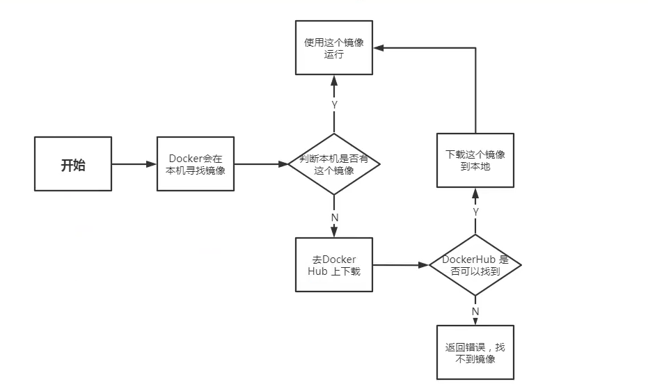

#### Docker底层原理

**Docker是怎么工作的？**

Docker是一个Client-Server结构的系统，Docker的守护进程运行在主机上。通过Socket从客户端访问。

DockerServer接收到Docker-Client的指令，就会执行这个命令。


**Docker为什么比虚拟机快？**

1、Docker有着比虚拟机更少的抽象层。


2、Docker利用宿主机的内核，虚拟机需要整个OS。

新建一个容器的时候，docker不需要像虚拟机一样重新加载一个操作系统内核，而是利用宿主机的操作系统，避免引导。虚拟机加载整个OS，响应慢。

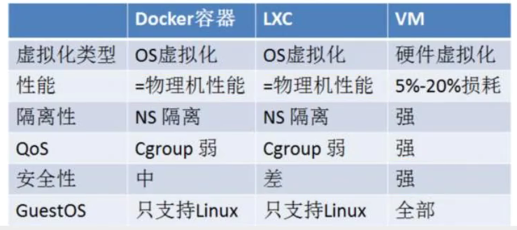


------


## *Docker命令

### 帮助命令

```shell
docker version  # 显示dokcer版本信息
docker info  # 显示docker的系统信息，包括镜像和容器数量
docker 命令 --help  # 万能
```

**帮助文档的地址**

官方：

https://docs.docker.com/reference/

菜鸟教程：

https://www.runoob.com/docker/docker-command-manual.html

### 镜像命令

#### docker images

```shell
docker images  # 查看所有镜像

# 可选项
-a, --all      # 列出所有镜像
-q, --quiet    # 只显示镜像的id
```
#### docker search
```shell
docker search 镜像名 # 搜索镜像

# 可选项
-f, --filter filter   Filter output based on conditions provided
    --format string   Pretty-print search using a Go template
    --limit int       Max number of search results (default 25)
    --no-trunc        Don't truncate output
```
#### docker pull
```shell
docker pull 镜像名[:tag]  # 下载镜像 默认使用最新版
Using default tag: latest
latest: Pulling from library/mysql

# 分层下载，image下载的核心 联合文件系统
bb79b6b2107f: Pull complete 
49e22f6fb9f7: Pull complete 
842b1255668c: Pull complete 
9f48d1f43000: Pull complete 
c693f0615bce: Pull complete 
8a621b9dbed2: Pull complete 
0807d32aef13: Pull complete 
a56aca0feb17: Pull complete 
de9d45fd0f07: Pull complete 
1d68a49161cc: Pull complete 
d16d318b774e: Pull complete 
49e112c55976: Pull complete 
Digest: sha256:8c17271df53ee3b843d6e16d46cff13f22c9c04d6982eb15a9a47bd5c9ac7e2d  # 签名
Status: Downloaded newer image for mysql:latest
docker.io/library/mysql:latest  # 真实地址
# 下面两条命令是等价的
#docker pull mysql 
#docker pull docker.io/library/mysql:latest

# 指定版本下载
docker pull mysql:5.7

docker pull --help
# 可选项
  -a, --all-tags                Download all tagged images in the repository
      --disable-content-trust   Skip image verification (default true)
```

#### docker rmi

> rm images 的意思    删除镜像

```shell
docker rmi -f db2b37ec6181
Untagged: mysql:latest
Untagged: mysql@sha256:8c17271df53ee3b843d6e16d46cff13f22c9c04d6982eb15a9a47bd5c9ac7e2d
Deleted: sha256:db2b37ec6181ee1f367363432f841bf3819d4a9f61d26e42ac16e5bd7ff2ec18
Deleted: sha256:4d2a8e0ab441c5c1170a783be98b47096324f531f84cc387f06523af79ee7cd5
Deleted: sha256:09e5f20e5b3289cedaf4824906f74057b5b9b8765a246d8bfaafded2562a901a
Deleted: sha256:c25bdaaaf298842706f214fd3d855ca6f215cc66d01345efb9fd7479f6ca7b5f
Deleted: sha256:64231a7235fe05862b419beb8884dec599d27cab1b1bb402f0f75e64bc4cbd19
Deleted: sha256:79bc33a7ecad0032cc5e218d8b246b645f4cfddbf639b5db8383f81d4cbb6c9b
Deleted: sha256:33134afe9e842a2898e36966f222fcddcdb2ab42e65dcdc581a4b38b2852c2e0
Deleted: sha256:dd053ec71039c3646324372061452778609b9ba42d1501f6a72c0272c94f8965
Deleted: sha256:2d4c647f875f6256f210459e5c401aad27ad223d0fa3bada7c4088a6040f8ba4
Deleted: sha256:4bded7e9aa769cb0560e60da97421e2314fa896c719179b926318640324d7932
Deleted: sha256:5fd9447ef700dfe5975c4cba51d3c9f2e757b34782fe145c1d7a12dfbee1da2f
Deleted: sha256:5ee7cbb203f3a7e90fe67330905c28e394e595ea2f4aa23b5d3a06534a960553
Deleted: sha256:d0fe97fa8b8cefdffcef1d62b65aba51a6c87b6679628a2b50fc6a7a579f764c
```

```shell
docker rmi -f $(docker images -aq)
# $(参数部分)
```

> docker rmi  -f  镜像id                              #删除指定镜像
>
> docker rmi  -f  镜像id  镜像id 镜像id     #删除多个镜像
>
> docker rmi -f $(docker images -aq)      #删除所有镜像


### 容器命令

> 说明：有镜像才可以创建容器，下载一个centos用来学习

```shell
docker pull centos
```


#### docker run [可选参数] image

> **新建容器并启动**
>
> https://www.runoob.com/docker/docker-run-command.html

```shell
docker run [可选参数] image

# 参数说明
--name="Name"  #容器名字 用来区分容器
-d             #以后台方式运行，ja nohup
-i			   #以交互模式运行容器，通常与 -t 同时使用
-t			   #为容器重新分配一个伪输入终端，通常与 -i 同时使用
-it            #使用交互方式运行，进入容器查看内容
-p             #指定容器端口  -p 8080:8080
	-p ip:主机端口:容器端口
	-p 主机端口:容器端口 （常用）
	-p 容器端口
	容器端口
-P             #随机指定端口

#测试
#启动并进入容器
[root@VM-0-14-centos ~]# docker run -it centos /bin/bash
#主机名变了↓ 这个主机名就是镜像ID
[root@212cafc3b289 /]# ls
bin  etc   lib    lost+found  mnt  proc  run   srv  tmp  var
dev  home  lib64  media       opt  root  sbin  sys  usr
#退出容器
[root@212cafc3b289 /]# exit
exit
[root@VM-0-14-centos ~]# 


docker run --help
```


#### docker ps

> 列出所有运行中的容器

```shell
[root@VM-0-14-centos ~]# docker ps
CONTAINER ID        IMAGE               COMMAND             CREATED             STATUS              PORTS               NAMES
```

> -a 列出当前正在运行的容器+历史运行过的容器
```shell
[root@VM-0-14-centos ~]# docker ps -a
CONTAINER ID        IMAGE               COMMAND                  CREATED             STATUS                       PORTS               NAMES
212cafc3b289        centos              "/bin/bash"              5 minutes ago       Exited (127) 2 minutes ago                       competent_goldstine
fa4d14c5a7cc        hello-world         "/hello"                 18 hours ago        Exited (0) 18 hours ago                          ecstatic_fermat
```

> -n=? 列出最近?个运行过的容器
```shell
[root@VM-0-14-centos ~]# docker ps -a -n=1
CONTAINER ID        IMAGE               COMMAND             CREATED             STATUS                       PORTS               NAMES
212cafc3b289        centos              "/bin/bash"         11 minutes ago      Exited (127) 8 minutes ago                       competent_goldstine

```

> -q 只显示容器编号

```shell
[root@VM-0-14-centos ~]# docker ps -aq
212cafc3b289
fa4d14c5a7cc
```

#### 退出容器

```shell
exit  # 直接容器停止并退出
Ctrl + p + q  # 容器不停止 退出
```

#### 删除容器

```shell
docker rm 容器ID               # 删除指定容器，运行中的容器不能删除，除非加-f
docker rm -f $(docker ps -aq)   #删除所有容器
docker ps -a -q|xargs docker rm #删除所有容器


[root@VM-0-14-centos ~]# docker ps -a
CONTAINER ID        IMAGE               COMMAND                  CREATED             STATUS                        PORTS               NAMES
d13ecaf1c41f        centos              "/bin/bash"              5 minutes ago       Up 5 minutes                                      dazzling_khorana
212cafc3b289        centos              "/bin/bash"              24 minutes ago      Exited (127) 22 minutes ago                       competent_goldstine
fa4d14c5a7cc        hello-world         "/hello"                 18 hours ago        Exited (0) 18 hours ago                           ecstatic_fermat

[root@VM-0-14-centos ~]# docker rm 212cafc3b289
212cafc3b289

# 运行中的容器不能删除  除非加-f
[root@VM-0-14-centos ~]# docker rm d13ecaf1c41f
Error response from daemon: You cannot remove a running container d13ecaf1c41fba7cbfb40d21ca194080a306cdfc854da9482a5f99f5fa68e8f4. Stop the container before attempting removal or force remove
```


#### 启动和停止容器

```shell
docker start 容器ID      #启动容器
docker restart 容器ID	   #重启容器
docker stop 容器ID	   #停止当前正在运行的容器
docker kill 容器ID	   #强制停止当前容器
```


#### 常用其他命令

##### 后台启动命令

```shell
docker run -d centos

# 命令 docker run -d 镜像名
[root@VM-0-14-centos ~]# docker run -d centos
2cf06c601d49de89317da04f6e6b283372c7905c108e2b9243de9243b1cb92bd
[root@VM-0-14-centos ~]# docker ps
CONTAINER ID        IMAGE               COMMAND             CREATED             STATUS              PORTS               NAMES

#ps的时候发现 centos 停止了？
#常见的坑: docker 容器使用后台运行，就必须要有一个前台进程，docker发现没有应用，就会自动停止
#nginx 容器启动后，发现自己没有提供服务，就会立即停止
```

##### 查看日志

```shell
docker logs -ft --tail num 容器ID

-f            #跟踪日志输出
-t            #显示时间戳
--tail num    #仅列出最新num条容器日志

#测试打印logs
docker run -d centos /bin/sh -c "while true;do echo test;sleep 1;done"
```

##### 查看容器中进程信息

```shell
docker top 容器ID

[root@VM-0-14-centos ~]# docker top 84e454a05da6
UID         PID         PPID        C           STIME       TTY         TIME         CMD
root        20561       20548       0           14:54       ?           00:00:00     /bin/sh -c while true;do echo test;sleep 1;done
root        21111       20561      0            14:55       ?           00:00:00     /usr/bin/coreutils --coreutils-prog-shebang=sleep /usr/bin/sleep 1

```

##### 进入当前正在运行的容器

```shell
# 我们通常容器都是使用后台方式运行的，需要进入容器进行一些操作

# 两种命令
docker exec -it 容器ID bashShell
docker attach 容器ID

#区别
#exec       #进入容器后开启一个新的终端，可以在里面操作（常用）
#attach     #进入容器正在执行的终端，不会启动新的进程
```
> [root@VM-0-14-centos ~]# docker exec --help
>
> Usage:  docker exec [OPTIONS] CONTAINER COMMAND [ARG...]
>
> Run a command in a running container
>
> Options:
>   -d, --detach               Detached mode: run command in the background
>       --detach-keys string   Override the key sequence for detaching a container
>   -e, --env list             Set environment variables
>   -i, --interactive          Keep STDIN open even if not attached
>       --privileged           Give extended privileges to the command
>   -t, --tty                  Allocate a pseudo-TTY
>   -u, --user string          Username or UID (format: <name|uid>[:<group|gid>])
>   -w, --workdir string       Working directory inside the container


> [root@VM-0-14-centos ~]# docker attach --help
>
> Usage:  docker attach [OPTIONS] CONTAINER
>
> Attach local standard input, output, and error streams to a running container
>
> Options:
>       --detach-keys string   Override the key sequence for detaching a container
>       --no-stdin             Do not attach STDIN
>       --sig-proxy            Proxy all received signals to the process (default true)

```shell
#测试
[root@VM-0-14-centos ~]# docker exec -it 84e454a05da6 /bin/bash
[root@84e454a05da6 /]# ps -ef
UID        PID  PPID  C STIME TTY          TIME CMD
root         1     0  0 06:54 ?        00:00:00 /bin/sh -c while true;do echo test;sleep 1;done
root       931     0  0 07:10 pts/0    00:00:00 /bin/bash
root       962     1  0 07:10 ?        00:00:00 /usr/bin/coreutils --coreutils-prog-shebang=sleep /us
root       963   931  0 07:10 pts/0    00:00:00 ps -ef

[root@VM-0-14-centos ~]# docker attach 84e454a05da6
#由于这个容器执行了一个死循环，只能另开一个命令行窗口执行 docker rm -f 84e454a05da6
```


##### 从容器内拷贝文件到主机上

```shell
docker cp 容器ID:容器内路径 目的主机路径
```

> Usage:  docker cp [OPTIONS] CONTAINER:SRC_PATH DEST_PATH|-
>         docker cp [OPTIONS] SRC_PATH|- CONTAINER:DEST_PATH
>
> Copy files/folders between a container and the local filesystem
>
> Options:
>   -a, --archive       Archive mode (copy all uid/gid information)
>   -L, --follow-link   Always follow symbol link in SRC_PATH

```shell
#测试
[root@4ceaeccb13a0 /]# cd /home
[root@4ceaeccb13a0 home]# touch test.txt
[root@4ceaeccb13a0 home]# exit
#exit只会停止退出，不会删除容器，只要容器还在数据就在
[root@VM-0-14-centos ~]# docker cp 4ceaeccb13a0:/home/test.txt ~
[root@VM-0-14-centos ~]# ls
test.txt
```


##### 查看镜像元数据

```shell
docker inspect 容器ID
```

> Usage:  docker inspect [OPTIONS] NAME|ID [NAME|ID...]
>
> Return low-level information on Docker objects
>
> Options:
>   -f, --format string   Format the output using the given Go template
>   -s, --size            Display total file sizes if the type is container
>       --type string     Return JSON for specified type

```shell
[root@VM-0-14-centos ~]# docker inspect 84e454a05da6
[
    {
        "Id": "84e454a05da66ee2042b575e2813131f419dfc4d73898bdaa47472c252d17624",
        "Created": "2020-11-10T06:54:56.150023899Z",
        "Path": "/bin/sh",
        "Args": [
            "-c",
            "while true;do echo test;sleep 1;done"
        ],
        "State": {
            "Status": "running",
            "Running": true,
            "Paused": false,
            "Restarting": false,
            "OOMKilled": false,
            "Dead": false,
            "Pid": 20561,
            "ExitCode": 0,
            "Error": "",
            "StartedAt": "2020-11-10T06:54:56.320228374Z",
            "FinishedAt": "0001-01-01T00:00:00Z"
        },
        "Image": "sha256:0d120b6ccaa8c5e149176798b3501d4dd1885f961922497cd0abef155c869566",
        "ResolvConfPath": "/var/lib/docker/containers/84e454a05da66ee2042b575e2813131f419dfc4d73898bdaa47472c252d17624/resolv.conf",
        "HostnamePath": "/var/lib/docker/containers/84e454a05da66ee2042b575e2813131f419dfc4d73898bdaa47472c252d17624/hostname",
        "HostsPath": "/var/lib/docker/containers/84e454a05da66ee2042b575e2813131f419dfc4d73898bdaa47472c252d17624/hosts",
        "LogPath": "/var/lib/docker/containers/84e454a05da66ee2042b575e2813131f419dfc4d73898bdaa47472c252d17624/84e454a05da66ee2042b575e2813131f419dfc4d73898bdaa47472c252d17624-json.log",
        "Name": "/gracious_hodgkin",
        "RestartCount": 0,
        "Driver": "overlay2",
        "Platform": "linux",
        "MountLabel": "",
        "ProcessLabel": "",
        "AppArmorProfile": "",
        "ExecIDs": null,
        "HostConfig": {
            "Binds": null,
            "ContainerIDFile": "",
            "LogConfig": {
                "Type": "json-file",
                "Config": {}
            },
            "NetworkMode": "default",
            "PortBindings": {},
            "RestartPolicy": {
                "Name": "no",
                "MaximumRetryCount": 0
            },
            "AutoRemove": false,
            "VolumeDriver": "",
            "VolumesFrom": null,
            "CapAdd": null,
            "CapDrop": null,
            "Dns": [],
            "DnsOptions": [],
            "DnsSearch": [],
            "ExtraHosts": null,
            "GroupAdd": null,
            "IpcMode": "shareable",
            "Cgroup": "",
            "Links": null,
            "OomScoreAdj": 0,
            "PidMode": "",
            "Privileged": false,
            "PublishAllPorts": false,
            "ReadonlyRootfs": false,
            "SecurityOpt": null,
            "UTSMode": "",
            "UsernsMode": "",
            "ShmSize": 67108864,
            "Runtime": "runc",
            "ConsoleSize": [
                0,
                0
            ],
            "Isolation": "",
            "CpuShares": 0,
            "Memory": 0,
            "NanoCpus": 0,
            "CgroupParent": "",
            "BlkioWeight": 0,
            "BlkioWeightDevice": [],
            "BlkioDeviceReadBps": null,
            "BlkioDeviceWriteBps": null,
            "BlkioDeviceReadIOps": null,
            "BlkioDeviceWriteIOps": null,
            "CpuPeriod": 0,
            "CpuQuota": 0,
            "CpuRealtimePeriod": 0,
            "CpuRealtimeRuntime": 0,
            "CpusetCpus": "",
            "CpusetMems": "",
            "Devices": [],
            "DeviceCgroupRules": null,
            "DiskQuota": 0,
            "KernelMemory": 0,
            "MemoryReservation": 0,
            "MemorySwap": 0,
            "MemorySwappiness": null,
            "OomKillDisable": false,
            "PidsLimit": 0,
            "Ulimits": null,
            "CpuCount": 0,
            "CpuPercent": 0,
            "IOMaximumIOps": 0,
            "IOMaximumBandwidth": 0
        },
        "GraphDriver": {
            "Data": {
                "LowerDir": "/var/lib/docker/overlay2/0d03c6ea4a95333bfe4825e0a1c673b14c556430281cd7dde2e973d6e39551d7-init/diff:/var/lib/docker/overlay2/27d36de6ec3d0620b04664d1f4cd6f4cf208f79a83ca9f0f5a82940d2d902bf4/diff",
                "MergedDir": "/var/lib/docker/overlay2/0d03c6ea4a95333bfe4825e0a1c673b14c556430281cd7dde2e973d6e39551d7/merged",
                "UpperDir": "/var/lib/docker/overlay2/0d03c6ea4a95333bfe4825e0a1c673b14c556430281cd7dde2e973d6e39551d7/diff",
                "WorkDir": "/var/lib/docker/overlay2/0d03c6ea4a95333bfe4825e0a1c673b14c556430281cd7dde2e973d6e39551d7/work"
            },
            "Name": "overlay2"
        },
        "Mounts": [],
        "Config": {
            "Hostname": "84e454a05da6",
            "Domainname": "",
            "User": "",
            "AttachStdin": false,
            "AttachStdout": false,
            "AttachStderr": false,
            "Tty": false,
            "OpenStdin": false,
            "StdinOnce": false,
            "Env": [
                "PATH=/usr/local/sbin:/usr/local/bin:/usr/sbin:/usr/bin:/sbin:/bin"
            ],
            "Cmd": [
                "/bin/sh",
                "-c",
                "while true;do echo test;sleep 1;done"
            ],
            "Image": "centos",
            "Volumes": null,
            "WorkingDir": "",
            "Entrypoint": null,
            "OnBuild": null,
            "Labels": {
                "org.label-schema.build-date": "20200809",
                "org.label-schema.license": "GPLv2",
                "org.label-schema.name": "CentOS Base Image",
                "org.label-schema.schema-version": "1.0",
                "org.label-schema.vendor": "CentOS"
            }
        },
        "NetworkSettings": {
            "Bridge": "",
            "SandboxID": "3dd2e4383466f5ffce92a961afc48732a802f4dd1a04abfb93879764c4a5e7de",
            "HairpinMode": false,
            "LinkLocalIPv6Address": "",
            "LinkLocalIPv6PrefixLen": 0,
            "Ports": {},
            "SandboxKey": "/var/run/docker/netns/3dd2e4383466",
            "SecondaryIPAddresses": null,
            "SecondaryIPv6Addresses": null,
            "EndpointID": "0f28a418fcebaa090a43139e12bed15ab1f44f3602cbf6d771b07e23a0db2084",
            "Gateway": "172.17.0.1",
            "GlobalIPv6Address": "",
            "GlobalIPv6PrefixLen": 0,
            "IPAddress": "172.17.0.2",
            "IPPrefixLen": 16,
            "IPv6Gateway": "",
            "MacAddress": "02:42:ac:11:00:02",
            "Networks": {
                "bridge": {
                    "IPAMConfig": null,
                    "Links": null,
                    "Aliases": null,
                    "NetworkID": "bd06e49eb40f0ac256f9d6f9d9c8024cea47b1a9c77fac275d942689bf007a3a",
                    "EndpointID": "0f28a418fcebaa090a43139e12bed15ab1f44f3602cbf6d771b07e23a0db2084",
                    "Gateway": "172.17.0.1",
                    "IPAddress": "172.17.0.2",
                    "IPPrefixLen": 16,
                    "IPv6Gateway": "",
                    "GlobalIPv6Address": "",
                    "GlobalIPv6PrefixLen": 0,
                    "MacAddress": "02:42:ac:11:00:02",
                    "DriverOpts": null
                }
            }
        }
    }
]

```


### *小结

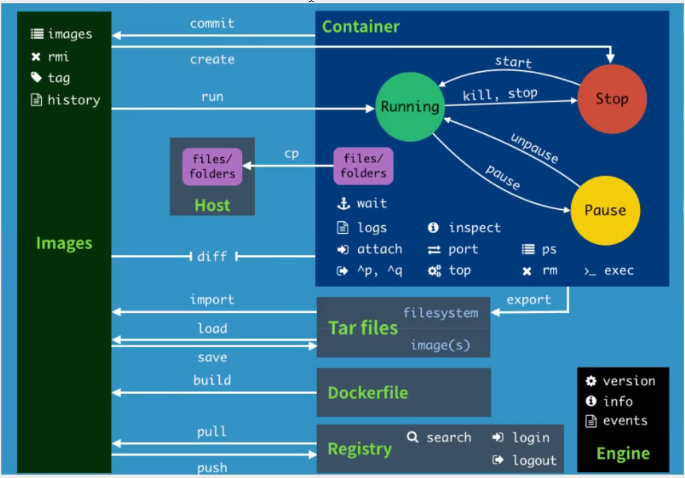

```shell
attach		Attach to a running container				#当前shell 下attach 连接指定运行镜像
build		Build an image from a Dockerfile			#通过 Dockerfile定制镜像
commit 		Create a new image from a container changes	# 提交当前容器为新的镜像
cp			Copy files/folders from the containers filesystem to the host path #从容器中拷贝指定文件或者目录到宿主机中
create		Create a new container						#创建一个新的容器,同run，但不启动容器
diff		Inspect changes on a container's filesystem	#查看docker容器变化
events		Get real time events from the server		#从docker服务获取容器实时事件
exec		Run a command in an existing container		#在已存在的容器上运行命令
export 		Stream the contents of a container as a tar archive #导出容器的内容流作为一个tar归档文件[对应import ]
history		Show the history of an image				#展示一个镜像形成历史
images		List images									#列出系统当前镜像
import 		Create a new filesystem image from the contents of a tarball # 从tar包中的内容创建一个新的文件系统映像[对应export]
info		Display system-wide information				#显示系统相关信息
inspect 	Return low-level information on a container	#查看容器详细信息
ki11		Kill a running container					# kill指定docker容器
load		Load an image from a tar archive			#从一个tar包中加载一个镜像[对应save]
login		Register or Login to the docker registry server #注册或者登陆一个docker 源服务器
logout		Log out from a Docker registry server		#从当前 Docker registry退出
logs		Fetch the logs of a container				#输出当前容器日志信息
port 		Lookup the public-facing port which is NAT-ed to PRIVATE_PORT #查看映射端口对应的容器内部源端口
pause		Pause all processes within a container		#暂停容器
ps			List containers								#列出容器列表
pull		Pull an image or a repository from the docker registry server # 从docker镜像源服务器拉取指定镜像或者库镜像
push		Push an image or a repository to the docker registry server #推送指定镜像或者库镜像至docker源服务器
restart		Restart a running container					#重启运行的容器
rm			Remove one or more containers				#移除一个或者多个容器
rmi			Remove one or more images					#移除一个或多个镜像[无容器使用该镜像才可删除，否则需删除相关容器才可继续或-f强制除]
run			Run a command in a new container			#创建一个新的容器并运行一个命令
save		Save an image to a tar archive				#保存一个镜像为一个tar包[对应load]
search		Search for an image on the Docker Hub		#在docker hub中搜索镜像
start		Start a stopped containers					#启动容器
stop		Stop a running containers					#停止容器
tag			Tag an image into a repository				#给源中镜像打标签
top			Lookup the runnfing processes of a container #查看容器中运行的进程信息
unpause		Unpause a paused container					#取消暂停容器
version		Show the docker version information			#查看docker版本号
wait		Block until a container stops，then print its exit code #截取容器停止时的退出状态值

```


### 部署实例

#### nginx

```shell
[root@VM-0-14-centos ~]# docker search nginx -f stars=10000
NAME                DESCRIPTION                STARS               OFFICIAL            AUTOMATED
nginx               Official build of Nginx.   13988               [OK]                
[root@VM-0-14-centos ~]# docker pull nginx
Using default tag: latest
latest: Pulling from library/nginx
bb79b6b2107f: Pull complete 
5a9f1c0027a7: Pull complete 
b5c20b2b484f: Pull complete 
166a2418f7e8: Pull complete 
1966ea362d23: Pull complete 
Digest: sha256:aeade65e99e5d5e7ce162833636f692354c227ff438556e5f3ed0335b7cc2f1b
Status: Downloaded newer image for nginx:latest
[root@VM-0-14-centos ~]# docker images
REPOSITORY          TAG                 IMAGE ID            CREATED             SIZE
nginx               latest              c39a868aad02        4 days ago          133MB
centos              latest              0d120b6ccaa8        3 months ago        215MB
hello-world         latest              bf756fb1ae65        10 months ago       13.3kB
[root@VM-0-14-centos ~]# docker run -d --name nginx01 -p 3344:80 nginx
29624d7bd75cc8406f0fffe88cc21b92d25b37493101df6e51d084873da3c0ff
[root@VM-0-14-centos ~]# docker ps
CONTAINER ID        IMAGE               COMMAND                  CREATED             STATUS              PORTS                  NAMES
29624d7bd75c        nginx               "/docker-entrypoint.…"   29 seconds ago      Up 27 seconds       0.0.0.0:3344->80/tcp   nginx01
[root@VM-0-14-centos ~]# curl localhost:3344
[返回的nginx默认网页  略]
[root@VM-0-14-centos ~]# docker exec -it nginx01 /bin/bash
root@29624d7bd75c:/# whereis nginx
nginx: /usr/sbin/nginx /usr/lib/nginx /etc/nginx /usr/share/nginx
root@29624d7bd75c:/# cd /etc/nginx/
root@29624d7bd75c:/etc/nginx# ls
conf.d          koi-utf  mime.types  nginx.conf   uwsgi_params
fastcgi_params  koi-win  modules     scgi_params  win-utf
```


#### tomcat

```shell
#官方的使用
docker run -it --rm tomcat:9.0

#之前都是后台启动，停止了容器之后还可以查到，--rm 就是用完即删

#正常使用
docker pull tomcat

docker run -d -p 3344:8080 --name tomcat01 tomcat

#测试访问没问题
#进入容器
docker exec -it tomcat01 /bin/bash

#发现问题
1、Linux命令少了
2、没有webapps
#默认是最小的镜像，不必要的东西都剔除了

[root@VM-0-14-centos ~]# docker run -d -p 3344:8080 --name tomcat01 tomcat
67b395eba71539c3d1cfd8804470340eda5df52dc4d5703ec37e69768b96462b
[root@VM-0-14-centos ~]# docker exec -it tomcat01 /bin/bash
root@67b395eba715:/usr/local/tomcat# ls
BUILDING.txt     NOTICE         RUNNING.txt  lib             temp          work
CONTRIBUTING.md  README.md      bin          logs            webapps
LICENSE          RELEASE-NOTES  conf         native-jni-lib  webapps.dist
#把预设的项目复制进去
root@67b395eba715:/usr/local/tomcat# cp -r webapps.dist/* webapps

#现在就可以正常访问了
```


#### es+kibana

> es暴露端口很多
>
> es十分耗内存
>
> es的数据一般需要放置到安全目录 （挂载）

> --net somenetwork  ?  网络配置
>
> -e "discovery.type=single-node"  集群相关
>
> -e 环境配置修改

```shell
docker run -d --name elasticsearch -p 9200:9200 -p 9300:9300 -e "discovery.type=single-node" elasticsearch:7.9.3

#增加内存限制
docker run -d --name elasticsearch02 -p 9200:9200 -p 9300:9300 -e "discovery.type=single-node" -e ES_JAVA_OPTS="-Xms64m -Xmx512m" elasticsearch:7.9.3

#测试
[root@VM-0-14-centos ~]# curl localhost:9200
{
  "name" : "274f621bac7e",
  "cluster_name" : "docker-cluster",
  "cluster_uuid" : "AkwMbmMWQvitX5xqUcVqGQ",
  "version" : {
    "number" : "7.9.3",
    "build_flavor" : "default",
    "build_type" : "docker",
    "build_hash" : "c4138e51121ef06a6404866cddc601906fe5c868",
    "build_date" : "2020-10-16T10:36:16.141335Z",
    "build_snapshot" : false,
    "lucene_version" : "8.6.2",
    "minimum_wire_compatibility_version" : "6.8.0",
    "minimum_index_compatibility_version" : "6.0.0-beta1"
  },
  "tagline" : "You Know, for Search"
}

```


### 可视化

- portainer

 > Docker的图形化管理工具，提供一个后台面板供我们操作

```shell
docker run -d -p 8088:9000 \
--restart=always -v /var/run/docker.sock:/var/run/docker.sock --privileged=true portainer/portainer

#访问测试
外部浏览器访问 ip:8088
```


- Rancher


------


## Docker镜像

### 镜像是什么

镜像是一种轻量级、可执行的独立软件包，用来打包软件运行环境和基于运行环境开发的软件，它包含运行某个软件所需的所有内容，包括代码、运行时、库、环境变量和配置文件

所有的应用，直接打包docker镜像，就可以直接跑起来

**如何得到镜像：**

- 从远程仓库下载
- 别人拷贝给你
- 自己制作一个镜像DockerFile

### Docker镜像加载原理

> **UnionFS（联合文件系统）**

UnionFS：Union文件系统是一种分层、轻量级并且高性能的文件系统，它支持对文件系统的修改作为一次提交来一层层地叠加，同时可以将不同目录挂载到同一个虚拟文件系统下。Union文件系统是Docker镜像的基础。镜像可以通过分层来进行继承，基于基础镜像（没有父镜像），可以制作各种具体的应用镜像。

特性：一次同时加载多个文件系统，但从外面看来，只能看到一个文件系统，联合加载会把各层文件系统叠加起来，这样最终的文件系统会包含所有底层的文件和目录

> **Docker镜像加载原理**

docker的镜像实际上由一层一层的文件系统组成，这种层级的文件系统UnionFS。

bootfs(boot file system)主要包含bootloader和kernel, bootloader主要是引导加载kernel, Linux刚启动时会加载bootfs文件系统，在Docker镜像的最底层是bootfs。这一层与我们典型的Linux/Unix系统是一样的，包含boot加载器和内核。当boot加载完成之后整个内核就都在内存中了，此时内存的使用权已由bootfs转交给内核，此时系统也会卸载bootfs。

rootfs (root file system)，在bootfs之上。包含的就是典型Linux系统中的/dev, /proc, /bin, /etc等标准目录和文件。rootfs就是各种不同的操作系统发行版，比如Ubuntu,Centos等等。

对于一个精简的OS ， rootfs可以很小，只需要包含最基本的命令，工具和程序库就可以了，因为底层直接用Host的kernel,自己只需要提供rootfs就可以了。由此可见对于不同的linux发行版, bootfs基本是一致的, rootfs会有差别,因此不同的发行版可以公用bootfs。


### 分层理解

**镜像的分层**

下载镜像的时候可以注意到下载是分层的。

> **分层下载，image下载的核心 联合文件系统**
>
> bb79b6b2107f: Pull complete 
> 49e22f6fb9f7: Pull complete 
> 842b1255668c: Pull complete 
> 9f48d1f43000: Pull complete 
> c693f0615bce: Pull complete 

```shell
docker inspect 容器ID
```

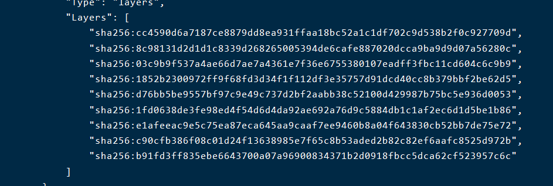


**理解∶**

**所有的Docker镜像都起始于一个基础镜像层，当进行修改或增加新的内容时，就会在当前镜像层之上，创建新的镜像层。**
举一个简单的例子，假如基于Ubuntu Linux16.04创建一个新的镜像，这就是新镜像的第一层；如果在该镜像中添加Python包，就会在基础镜像层之上创建第二个镜像层；如果继续添加一个安全补丁，就会创建第三个镜像层。
该镜像当前已经包含3个镜像层，如下图所示(这只是一个用于演示的很简单的例子)。


在添加额外的镜像层的同时，镜像始终保持是当前所有镜像的组合，理解这一点非常重要。下图中举了一个简单的例子，每个镜像层包含3个文件，而镜像包含了来自两个镜像层的6个文件。


上图中的镜像层跟之前图中的略有区别，主要目的是便于展示文件。
下图中展示了一个稍微复杂的三层镜像，在外部看来整个镜像只有6个文件，这是因为最上层中的文件7是文件5的一个更新版本。


这种情况下，上层镜像层中的文件覆盖了底层镜像层中的文件。这样就使得文件的更新版本作为一个新镜像层添加到镜像当中。Docker通过存储引擎（新版本采用快照机制）的方式来实现镜像层堆栈，并保证多镜像层对外展示为统一的文件系统。
Linux上可用的存储引擎有AUFS、Overlay2、Device Mapper、Btrfs 以及ZFS。顾名思义，每种存储引擎都基于Linux中对应的文件系统或者块设备技术，并且每种存储引擎都有其独有的性能特点。
Docker在Windows上仅支持windows filter一种存储引擎，该引擎基于NTFS文件系统之上实现了分层和CoW[1]。下图展示了与系统显示相同的三层镜像。所有镜像层堆叠并合并，对外提供统一的视图。


**特点**

Docker镜像都是只读的，当容器启动时，一个新的可写层被加载到镜像的顶部！

这一层就是我们通常说的容器层，容器之下的都叫镜像层！


### 如何提交自己的镜像

```shell
docker commit 提交容器成为一个新的副本

#命令和git类似
docker commit -m="描述信息" -a="作者" 容器ID 目标镜像名:[TAG]

#1、启动一个默认的tomcat 默认tomcat没有webapps应用，因为官方的就没有
#所以自己拷贝了基本文件
#这就相当于在镜像层上添加了容器层，可以自己打包一个了
[root@VM-0-14-centos ~]# docker commit -a="jiemoo" -m="add webapps" bd4598ee64e4 tomcat02:1.0
sha256:b4e08d6e5b67d92661892e7662700af218c212e6a3017c7e4b36fc830ab96f59
[root@VM-0-14-centos ~]# docker images
REPOSITORY            TAG                 IMAGE ID            CREATED             SIZE
tomcat02              1.0                 b4e08d6e5b67        11 seconds ago      653MB
tomcat                latest              dab3cf97dd54        4 days ago          648MB
elasticsearch         7.9.3               1ab13f928dc8        3 weeks ago         742MB
centos                latest              0d120b6ccaa8        3 months ago        215MB
portainer/portainer   latest              62771b0b9b09        3 months ago        79.1MB

#将刚才的容器通过commit提交为一个新的镜像，以后就可以使用我们自己修改过的镜像了
```


------


## 容器数据卷

### 什么是容器数据卷

**docker的理念**

将应用和环境打包成一个镜像，启动运行就变成一个容器。

所以数据不应当保存在容器中，因为容器一删除数据就没了。

比如MySQL，容器删了==删库跑路


**需求：数据持久化**

容器之间有可以数据共享的技术，Docker容器中产生的数据同步到本地。

这就是卷技术。其实就是目录的挂载，将容器内的目录挂载到主机上。

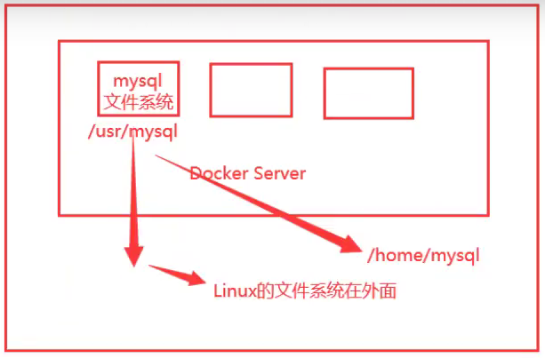

**容器的持久化和同步操作！容器间也可以共享数据！**


### 使用数据卷

> 方式一：直接用命令来挂载  -v

```shell
docker run -it -v 主机目录:容器内目录
#类似于-p 主机端口:容器端口

#测试
[root@VM-0-14-centos ~]# docker run -it -v ~/ceshi:/home centos /bin/bash
[root@5f8fcf10c90a /]# cd /home/
[root@5f8fcf10c90a home]# touch 1.txt

#另开一个终端
[root@VM-0-14-centos ~]# cd ceshi/
[root@VM-0-14-centos ceshi]# ls
#等另一个终端创建了1.txt
[root@VM-0-14-centos ceshi]# ls
1.txt

#查看容器是否挂载成功
docker inspect 5f8fcf10c90a(你自己的容器ID)
```


```shell
#然后在主机的ceshi目录下
[root@VM-0-14-centos ceshi]# touch 2.txt
[root@VM-0-14-centos ceshi]# ls
1.txt  2.txt

#回到docker内
[root@5f8fcf10c90a home]# ls
1.txt  2.txt

#会发现这两个目录之间就是双向同步的
#并没有分源，目标的概念
#原因是上图中的Type为"bind"模式
```

### 实战：安装MySQL

> MySQL的数据持久化问题就要用 **数据卷** 来解决

```shell
#获取镜像
docker pull mysql

#官方的启动方式
$ docker run --name some-mysql -e MYSQL_ROOT_PASSWORD=my-secret-pw -d mysql:tag

#运行容器，做数据挂载
#不要直接这样启动！！
docker run -d -p 3310:3306 -v ~/mysqlceshi/conf:/etc/mysql/conf.d -v ~/mysqlceshi/data:/var/lib/mysql -e MYSQL_ROOT_PASSWORD=12345678 --name mysql01 mysql

-d:后台启动
-p:端口映射
-v:目录挂载
-e:环境配置
--name 名字


```


**重要！！！！**

**这样的启动方式其实是错误的！**

**虽然能启动成功**

**但是正确的做法应该是先创建docker容器**

**然后把文件复制出来之后在关闭容器重新挂载启动**


> 查看数据库内容


> 新建一个数据库


> 新建成功


假设我们现在把容器删除

```shell
[root@VM-0-14-centos ~]# docker rm -f 950b3ff23a0e
```

再ls一遍data目录


所有的数据都还在

这就实现了数据的持久化


### *官方名词

- 具名挂载

```shell
#测试
[root@VM-0-14-centos ~]# docker run -d -P -v juming-nginx:/etc/nginx --name nginx02 nginx
[root@VM-0-14-centos ~]# docker volume ls
DRIVER              VOLUME NAME
local				juming-nginx
[root@VM-0-14-centos ~]# docker volume inspect juming-nginx
```

  

- 匿名挂载

```shell
-v 容器内路径

#测试
[root@VM-0-14-centos ~]# docker run -d -P --name nginx01 -v /etc/nginx nginx
#查看卷情况
[root@VM-0-14-centos ~]# docker volume ls
DRIVER              VOLUME NAME
local               4003174c04df08738cb6639ec6c9e2088a93f1cb2dd9b9b7720d19a20facd453
local               70ef90094f16f34112f0ac8c648e9e67c7b7868fcde5a45f09f06c41a802544f
local               c88947b8f06a27e3ee53008a78ab5656258f183341a6060aad5696fcefca1d12
#这种就是匿名挂载 -v只写了容器内路径，没写容器外路径

#查看匿名挂载的文件位置
[root@VM-0-14-centos ~]# docker volume inspect [VOLUME NAME]

```


**所有docker容器内的卷没有指定位置的情况下都是在**`/var/lib/docker/volumes/xxxx/_data`**这个目录下**


### 如何确定是匿名挂载还是指定路径挂载？

```shell
-v 容器内路径                #匿名挂载
-v 卷名:容器内路径            #具名挂载(卷名只是一个名字，不是以/开头的绝对路径)
-v /具体的路径:/容器内路径     #指定路径挂载(路径部分都是绝对路径)
```


### 拓展

```shell
#通过 -v 容器内路径:ro rw改变读写权限
#ro		read only	#只读
#rw		read write	#读写

#一旦设定了容器权限，容器对我们挂载出来的内容就有了限制
docker run -v [主机路径:|卷名:]容器内路径[:ro|:rw] 容器ID

#这个权限是针对容器内的目录设定的
#比如现在设定了:ro 只读 那么这个目录以后就不能从容器内部进行操作，只能通过主机操作了
```


### 初识DockerFile

> DockerFile就是用来 **构建docker 镜像文件 **的 **构建文件**
>
> 就是一段命令脚本
>
> 通过这个脚本可以生成镜像

```shell
#创建一个dockerfile文件，名字可以随意 但是最好就是Dockerfile
#文件内容 指令都是大写的

FROM centos
VOLUME ["volume01","volume02"]		#这是一个匿名挂载
CMD echo "-----end-----"
CMD /bin/bash
```

```shell
docker build -f dockerfile1 -t jiemoo/centos:1.0 .
-f dockerfile脚本的路径(可以是相对路径)
-t 镜像名字:版本号
REPOSITORY       TAG     IMAGE ID        CREATED              SIZE
jiemoo/centos    1.0     27cb55142d56    About a minute ago   215MB
. 当前路径
```


```shell
#启动测试

[root@VM-0-14-centos ~]# docker images
REPOSITORY            TAG                 IMAGE ID            CREATED             SIZE
jiemoo/centos         1.0                 27cb55142d56        9 minutes ago       215MB

[root@VM-0-14-centos ~]# docker run -it 27cb55142d56 /bin/bash
[root@ab45e1142eaf /]# 


```


这个卷就是我们自动挂载的目录

那么这个卷就一定在外部有一个同步的目录

```shell
#创建一个测试文件

[root@ab45e1142eaf /]# cd volume01
[root@ab45e1142eaf volume01]# touch container.txt

#到主机查看一下容器信息
[root@VM-0-14-centos ~]# docker inspect ab45e1142eaf
```


```shell
#进入主机的目录查看是否存在container.txt
[root@VM-0-14-centos ~]# cd /var/lib/docker/volumes/26b2c93c19b8201354985e13c6bc494ae121e89c1c41ddd0de3f3a45d3766821/_data
[root@VM-0-14-centos _data]# ls
container.txt
```

### 数据卷容器

多个MySQL同步数据


```shell
#启动3个容器，测试

#首先启动第一个
[root@VM-0-14-centos ~]# docker run -it --name docker01 27cb55142d56 /bin/bash
[root@e5c03bc8b735 /]# ls -l
total 56
[中间的文件 略]
drwxr-xr-x   2 root root 4096 Nov 11 08:50 volume01
drwxr-xr-x   2 root root 4096 Nov 11 08:50 volume02

#创建第二个
[root@VM-0-14-centos ~]# docker run -it --name docker02 --volumes-from docker01 27cb55142d56 /bin/bash
[root@e3535b49f3f3 /]# ls -l
total 56
[中间的文件 略]
drwxr-xr-x   2 root root 4096 Nov 11 08:50 volume01
drwxr-xr-x   2 root root 4096 Nov 11 08:50 volume02

#进入第一个容器
[root@VM-0-14-centos ~]# docker attach e5c03bc8b735
[root@e5c03bc8b735 /]# cd volume01
[root@e5c03bc8b735 volume01]# ls        
[root@e5c03bc8b735 volume01]# touch docker01

#如果这两个文件是同步的，那么进入第二个容器也能看到
#进入第二个容器
[root@VM-0-14-centos ~]# docker attach e3535b49f3f3
[root@e3535b49f3f3 /]# cd volume01
[root@e3535b49f3f3 volume01]# ls
docker01

#然后我们再创建第三个容器
[root@VM-0-14-centos ~]# docker run -it --name docker03 --volumes-from docker01 27cb55142d56
[root@798e78065f80 /]# ls
bin  dev  etc  home  lib  lib64  lost+found  media  mnt  opt  proc  root  run  sbin  srv  sys  tmp  usr  var  volume01  volume02
[root@798e78065f80 /]# cd volume01
[root@798e78065f80 volume01]# ls
docker01
#再在第三个创建一个文件
[root@798e78065f80 volume01]# touch docker03
[root@798e78065f80 volume01]# ls
docker01  docker03
#返回第一个看看
[root@e5c03bc8b735 volume01]# ls
docker01  docker03
#返回第二个看看
[root@e3535b49f3f3 volume01]# ls 
docker01  docker03

#所有容器中都同步了

#只要通过--volumes-from
#就可以实现容器间的数据共享

#如果这时候把第一个直接删除会怎么样？
[root@VM-0-14-centos ~]# docker rm -f e5c03bc8b735
#在第三个容器看看
[root@e3535b49f3f3 volume01]# ls
docker01  docker03
#数据当然还是在的
#相当于硬链接

#那么现在在被共同链接的第一个已经被删除后，在第二个上删除文件第三个会被同步吗？
#进入第二个
[root@VM-0-14-centos ~]# docker attach 798e78065f80
[root@798e78065f80 volume01]# ls
docker01  docker03
#进入第三个
[root@VM-0-14-centos ~]# docker attach e3535b49f3f3
[root@e3535b49f3f3 volume01]# ls
docker01  docker03
[root@e3535b49f3f3 volume01]# rm docker03
rm: remove regular empty file 'docker03'? y
#返回第二个
[root@798e78065f80 volume01]# ls
docker01

```

**用MySQL试试**

```shell
[root@VM-0-14-centos ~]# docker run -d -p 3310:3306 -v /etc/mysql/conf.d -v /var/lib/mysql -e MYSQL_ROOT_PASSWORD=123456 --name mysql01 mysql

[root@VM-0-14-centos ~]# docker run -d -p 3311:3306 --volumes-from mysql01 -e MYSQL_ROOT_PASSWORD=123456 --name mysql02 mysql

#这就可以实现两个容器数据同步了
#数据卷容器的生命周期一直持续到没有容器继续使用它为止
#但是你一旦把数据持久化到了主机，那么主机的数据是无论如何不会被删除的 除非你自己在主机上自己删除
```


------


## DockerFile

dockerfile是用来构建docker镜像的文件，就是命令参数脚本

> 构建步骤：
>
> 1. 编写一个dockerfile文件
> 2. docker build 构建成为一个镜像
> 3. docker run 运行镜像
> 4. docker push 发布镜像（DockerHub、阿里云镜像仓库）


点击版本号就会跳转到Github项目中


很多官方镜像都是基础包，很多功能都是没有的，我们通常会搭建自己的镜像

### Dockerfile的构建过程

**基础知识**

1. 每个保留关键字（指令）都必须是大写字母
2. 执行从上到下顺序执行
3. #表示注释
4. 每个指令都会创建提交一个新的镜像层，并提交

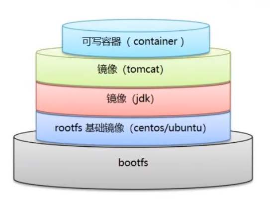

dockerfile是面向开发的，以后要发布项目，做镜像，就需要编写dockerfile文件，这个文件非常简单

**Docker镜像逐渐成为企业交付的标准**

DockerFile：构建文件，定义了一切的步骤，源代码

DockerImages：通过DockerFile构建生成的镜像，最终发布和运行的产品

Docker容器：容器就是镜像运行起来提供的服务


### DockerFIle的指令

> 很多指令：
```shell
FROM                   #基础镜像，一切从这里开始
MAINTAINER             #镜像是谁写的，姓名+邮箱
RUN                    #镜像构建的时候需要运行的命令
ADD                    #添加压缩包
WORKDIR                #镜像的工作目录
VOLUME                 #挂载的目录
EXPOST                 #保留端口配置
CMD                    #指定这个容器启动时要运行的命令，只有最后一个会生效，可被替代
ENTRYPOINT             #指定这个容器启动时要运行的命令，可以追加命令
ONBUILD                #当构建一个被继承的 DockerFile， 这个时候就会运行ONBUILD的指令
COPY                   #类似ADD，将文件拷贝到镜像中
ENV                    #构建的时候设置环境变量
```


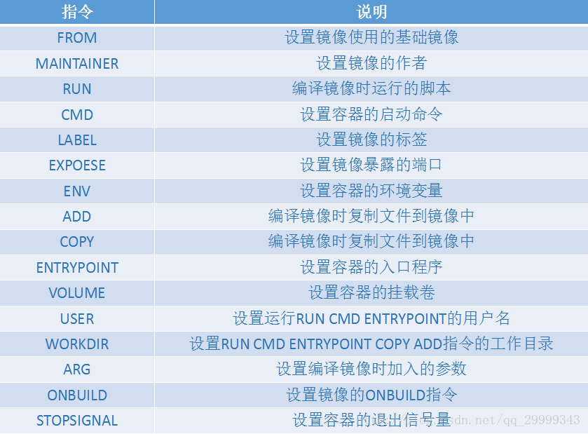

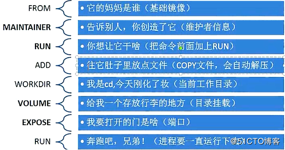


### 实战测试

Docker Hub中99%的镜像都是 FROM scratch 的，然后配置需要的软件和配置来进行构建


```shell
FROM scratch
ADD centos-7-x86_64-docker.tar.xz /

LABEL \
    org.label-schema.schema-version="1.0" \
    org.label-schema.name="CentOS Base Image" \
    org.label-schema.vendor="CentOS" \
    org.label-schema.license="GPLv2" \
    org.label-schema.build-date="20200809" \
    org.opencontainers.image.title="CentOS Base Image" \
    org.opencontainers.image.vendor="CentOS" \
    org.opencontainers.image.licenses="GPL-2.0-only" \
    org.opencontainers.image.created="2020-08-09 00:00:00+01:00"

CMD ["/bin/bash"]
```

**尝试创建**

```shell
# 编写DockerFile
[root@VM-0-14-centos dockerfile]# vim mydockerfile-centos
[root@VM-0-14-centos dockerfile]# cat mydockerfile-centos 
FROM centos
MAINTAINER jiemoo<978090944@qq.com>

ENV MYPATH /usr/local
WORKDIR $MYPATH

RUN yum -y install vim
RUN yum -y install net-tools

EXPOSE 80

CMD echo $MYPATH
CMD echo "---end---"
CMD /bin/bash
#-f dockerfile 文件路径 -t 镜像名:版本号
[root@VM-0-14-centos dockerfile]# docker build -f mydockerfile-centos -t mycentos:0.1 .  #注意这里有个点 代表当前目录是上下文环境
[输出信息略]
Successfully built 861801ebd3f1
Successfully tagged mycentos:0.1

[root@VM-0-14-centos dockerfile]# docker images
REPOSITORY      TAG         IMAGE ID            CREATED             SIZE
mycentos        0.1         861801ebd3f1        24 seconds ago      295MB

#运行测试
[root@VM-0-14-centos dockerfile]# docker run -it 861801ebd3f1
[root@3f418c9ab6ce local]# pwd
/usr/local
#直接就是工作目录
[root@3f418c9ab6ce local]# vim
[root@3f418c9ab6ce local]# ifconfig
#这两个也都能用了
```

**列出本地镜像的变更历史**

```shell
[root@VM-0-14-centos dockerfile]# docker history 861801ebd3f1
IMAGE               CREATED             CREATED BY                                      SIZE                COMMENT
861801ebd3f1        9 minutes ago       /bin/sh -c #(nop)  CMD ["/bin/sh" "-c" "/bin…   0B                  
aedef5310350        9 minutes ago       /bin/sh -c #(nop)  CMD ["/bin/sh" "-c" "echo…   0B                  
51c43530f274        9 minutes ago       /bin/sh -c #(nop)  CMD ["/bin/sh" "-c" "echo…   0B                  
e3ede2fc2b09        9 minutes ago       /bin/sh -c #(nop)  EXPOSE 80                    0B                  
c6257a0f7ed6        9 minutes ago       /bin/sh -c yum -y install net-tools             22.8MB              
5f27aaf714f4        9 minutes ago       /bin/sh -c yum -y install vim                   57.2MB              
0c988d2d9fa1        9 minutes ago       /bin/sh -c #(nop) WORKDIR /usr/local            0B                  
a907a0ae34fa        9 minutes ago       /bin/sh -c #(nop)  ENV MYPATH=/usr/local        0B                  
9549674121fd        9 minutes ago       /bin/sh -c #(nop)  MAINTAINER jiemoo<9780909…   0B                  
0d120b6ccaa8        3 months ago        /bin/sh -c #(nop)  CMD ["/bin/bash"]            0B                  
<missing>           3 months ago        /bin/sh -c #(nop)  LABEL org.label-schema.sc…   0B                  
<missing>           3 months ago        /bin/sh -c #(nop) ADD file:538afc0c5c964ce0d…   215MB               

```


### 一些指令的区别

> CMD 和 ENTRYPOINT 的区别
>
> CMD                           #指定这个容器启动时要运行的命令，只有最后一个会生效，可被替代
> ENTRYPOINT             #指定这个容器启动时要运行的命令，可以追加命令

**CMD的效果**

```shell
[root@VM-0-14-centos dockerfile]# cat dockerfile-cmd-test 
FROM centos
CMD ["ls","-a"]
[root@VM-0-14-centos dockerfile]# docker build -f dockerfile-cmd-test -t cmdtest .
[root@VM-0-14-centos dockerfile]# docker run cc2edd92a3e0
#目录都输出出来了
#本来直接追加-l 是可以显示出ls -al的效果，但因为这是CMD命令，-l替换了CMD命令，-l不是命令所以报错了
[root@VM-0-14-centos dockerfile]# docker run cc2edd92a3e0 -l
docker: Error response from daemon: OCI runtime create failed: container_linux.go:296: starting container process caused "exec: \"-l\": executable file not found in $PATH": unknown.
[root@VM-0-14-centos dockerfile]# docker run cc2edd92a3e0 ls -al
[目录 略]
#这样就能输出了
```

**ENTRYPOINT的效果**

```shell
[root@VM-0-14-centos dockerfile]# cat dockerfile-cmd-entrypoint 
FROM centos
ENTRYPOINT ["ls","-a"]
[root@VM-0-14-centos dockerfile]# docker build -f dockerfile-cmd-entrypoint -t eptest .
[root@VM-0-14-centos dockerfile]# docker run c42c343bedae
[输出了ls -a的效果]
[root@VM-0-14-centos dockerfile]# docker run c42c343bedae -l
[输出了ls -al的效果]
```

**DockerFile中很多命令都非常相似，我们需要了解他们的区别，最好的学习方法就是对比然后测试**


### Tomcat实战

1. 准备镜像文件，tomcat压缩包，jdk的压缩包
2. 编写dockerfile文件
3. 构建镜像

**在编写的时候使用官方的 Dockerfile 这个名字就可以不指定-f，build会默认寻找这个文件**

```shell
[root@VM-0-14-centos build]# cat Dockerfile 
FROM centos
MAINTAINER jiemoo<978090944@qq.com>

COPY readme.txt /usr/local/readme.txt
ADD apache-tomcat-9.0.39.tar.gz /usr/local/
#还有一个jdk的不过没下载到 添加方法同上

RUN yum -y install vim

ENV MYPATH /usr/local
WORKDIR $MYPATH

ENV JAVA_HOME /usr/local/jdk1.8.0_11
ENV CLASSPATH $JAVA_HOME/lib/dt.jar:$JAVA_HOME/lib/tools.jar
ENV CATALINA_HOME /usr/local/apache-tomcat-9.0.39
ENV CATALINA_BASH /usr/local/apache-tomcat-9.0.39
ENV PATH $PATH:$JAVA_HOME/bin:$CATALINA_HOME/lib:$CATALINA_HOME/bin

EXPOSE 8080

CMD /usr/local/apache-tomcat-9.0.39/bin/startup.sh && tail -F /usr/local/apache-tomcat-9.0.39/bin/logs/catalina.out

[root@VM-0-14-centos build]# docker build -t diytomcat .
Successfully built f613a52ee819
Successfully tagged diytomcat:latest

```


### 发布自己的镜像

**发布到Docker Hub**

1. 注册docker账号
2. 登陆docker账号

```shell
#不建议的方式
[root@VM-0-14-centos test]# docker login -u [账号] -p [密码]

#建议
[root@VM-0-14-centos test]# docker login -u [账号]
Password: [你的密码]
Login Succeeded


#push
[root@VM-0-14-centos test]# docker push jiemoo/centos:1.0

```

阿里云和腾讯云可以到对应网站控制台自行查询 网站上有完整流程


------


## Docker网络原理

### 理解Docker0

清空镜像

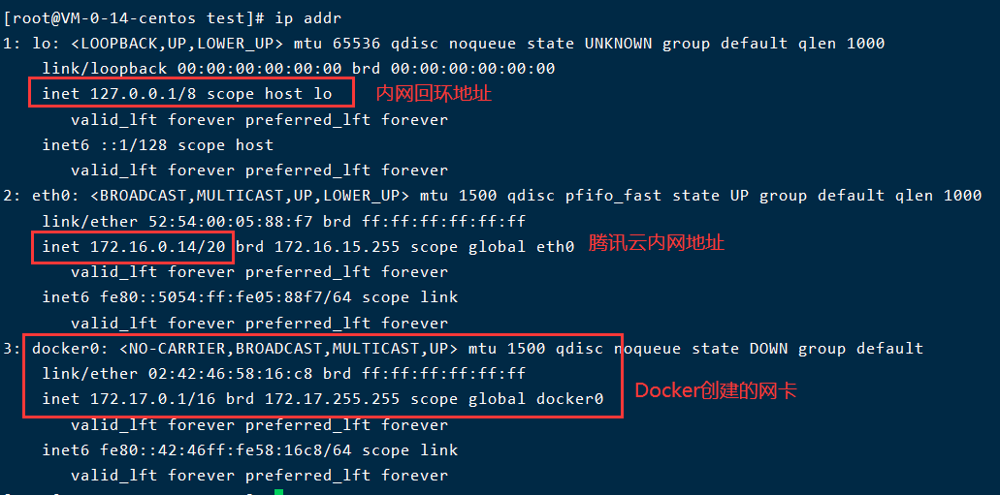

这里有三个网卡

**问题：Docker 是怎么样处理容器访问的？**

启动一个tomcat作为测试

```shell
[root@VM-0-14-centos test]# docker run -d -P --name tomcat01 tomcat
[root@VM-0-14-centos test]# docker exec -it tomcat01 ip addr
1: lo: <LOOPBACK,UP,LOWER_UP> mtu 65536 qdisc noqueue state UNKNOWN group default qlen 1000
    link/loopback 00:00:00:00:00:00 brd 00:00:00:00:00:00
    inet 127.0.0.1/8 scope host lo
       valid_lft forever preferred_lft forever
80: eth0@if81: <BROADCAST,MULTICAST,UP,LOWER_UP> mtu 1500 qdisc noqueue state UP group default 
    link/ether 02:42:ac:11:00:02 brd ff:ff:ff:ff:ff:ff link-netnsid 0
    inet 172.17.0.2/16 brd 172.17.255.255 scope global eth0
       valid_lft forever preferred_lft forever

#这里我们可以发现有一个eth0@if81 172.17.0.2，这是docker分配的
#那么linux能不能ping通这个容器内部呢？
[root@VM-0-14-centos test]# ping 172.17.0.2
PING 172.17.0.2 (172.17.0.2) 56(84) bytes of data.
64 bytes from 172.17.0.2: icmp_seq=1 ttl=64 time=0.076 ms
64 bytes from 172.17.0.2: icmp_seq=2 ttl=64 time=0.038 ms
64 bytes from 172.17.0.2: icmp_seq=3 ttl=64 time=0.051 ms
64 bytes from 172.17.0.2: icmp_seq=4 ttl=64 time=0.041 ms
--- 172.17.0.2 ping statistics ---
4 packets transmitted, 4 received, 0% packet loss, time 2999ms
rtt min/avg/max/mdev = 0.038/0.051/0.076/0.016 ms

```

**当然是可以的**

我们每启动一个docker容器，docker就会给docker容器分配一个ip，我们只要安装了docker，就会有一个网卡docker0。

桥接模式使用的技术是veth-pair技术

现在我们再回到主机上，使用ip addr命令

```shell
[root@VM-0-14-centos test]# ip addr
1: lo: <LOOPBACK,UP,LOWER_UP> mtu 65536 qdisc noqueue state UNKNOWN group default qlen 1000
    link/loopback 00:00:00:00:00:00 brd 00:00:00:00:00:00
    inet 127.0.0.1/8 scope host lo
       valid_lft forever preferred_lft forever
    inet6 ::1/128 scope host 
       valid_lft forever preferred_lft forever
2: eth0: <BROADCAST,MULTICAST,UP,LOWER_UP> mtu 1500 qdisc pfifo_fast state UP group default qlen 1000
    link/ether 52:54:00:05:88:f7 brd ff:ff:ff:ff:ff:ff
    inet 172.16.0.14/20 brd 172.16.15.255 scope global eth0
       valid_lft forever preferred_lft forever
    inet6 fe80::5054:ff:fe05:88f7/64 scope link 
       valid_lft forever preferred_lft forever
3: docker0: <BROADCAST,MULTICAST,UP,LOWER_UP> mtu 1500 qdisc noqueue state UP group default 
    link/ether 02:42:46:58:16:c8 brd ff:ff:ff:ff:ff:ff
    inet 172.17.0.1/16 brd 172.17.255.255 scope global docker0
       valid_lft forever preferred_lft forever
    inet6 fe80::42:46ff:fe58:16c8/64 scope link 
       valid_lft forever preferred_lft forever
81: veth4344eb5@if80: <BROADCAST,MULTICAST,UP,LOWER_UP> mtu 1500 qdisc noqueue master docker0 state UP group default 
    link/ether 9a:75:7b:94:4c:9c brd ff:ff:ff:ff:ff:ff link-netnsid 0
    inet6 fe80::9875:7bff:fe94:4c9c/64 scope link 
       valid_lft forever preferred_lft forever

```

可以发现这里有一个网卡81，他连接的是80，也就是刚才那个容器的网卡编号


那我们再启动一个tomcat02，再查看ip addr


又多了一对82 83网卡。

我们可以发现，网卡都是一对出现的

**veth-pair 就是一对的虚拟设备接口，他们都是成对出现的，一端连着协议，一端彼此相连**

因为这个特性，一般我们使用 veth-pair 作为一个桥梁，连接各种虚拟网络设备的

Docker容器之间的通讯，都是使用 veth-pair 技术

```shell
#尝试在tomcat02 ping tomcat01
[root@VM-0-14-centos test]# docker exec -it tomcat02 ping 172.17.0.2
PING 172.17.0.2 (172.17.0.2) 56(84) bytes of data.
64 bytes from 172.17.0.2: icmp_seq=1 ttl=64 time=0.101 ms
64 bytes from 172.17.0.2: icmp_seq=2 ttl=64 time=0.090 ms
64 bytes from 172.17.0.2: icmp_seq=3 ttl=64 time=0.067 ms
^C
--- 172.17.0.2 ping statistics ---
3 packets transmitted, 3 received, 0% packet loss, time 4ms
rtt min/avg/max/mdev = 0.067/0.086/0.101/0.014 ms

```

**结论**

容器之间是可以互相ping通的


所有的网络在不指定--net的情况下都是由docker0来路由的，docker会给每个容器分配一个默认的可用ip

Docker使用的是Linux的桥接，宿主机中是一个docker容器的网桥docker0


Docker中所有的网络接口都是虚拟的，因为虚拟的转发效率高。

**只要容器删除，对应的一对网桥就也会被删除。**


### --link

> 思考一个场景，假设现在我们的服务器重启了，所有容器重新启动，那么ip地址就会改变，那么就有可能出现绑定的ip失效的问题，那么能不能通过容器名字来进行绑定呢？

```shell
[root@VM-0-14-centos test]# docker exec -it tomcat01 ping tomcat01
ping: tomcat01: Name or service not known
```

**直接这样写是不行的，那么如何解决？**

```shell
#创建一个tomcat03  通过--link 容器 和要绑定的容器连接
[root@VM-0-14-centos test]# docker run -d -P --name tomcat03 --link tomcat02 tomcat
10702cb4bda7abdc1c51cf445016f45b3679750f783f7dc33b163728f82458c2

#现在再ping就可以ping通了
[root@VM-0-14-centos test]# docker exec -it tomcat03 ping tomcat02
PING tomcat02 (172.17.0.3) 56(84) bytes of data.
64 bytes from tomcat02 (172.17.0.3): icmp_seq=1 ttl=64 time=0.108 ms
64 bytes from tomcat02 (172.17.0.3): icmp_seq=2 ttl=64 time=0.059 ms
64 bytes from tomcat02 (172.17.0.3): icmp_seq=3 ttl=64 time=0.067 ms
^C
--- tomcat02 ping statistics ---
3 packets transmitted, 3 received, 0% packet loss, time 4ms
rtt min/avg/max/mdev = 0.059/0.078/0.108/0.021 ms

#那么反向可以ping通吗？
[root@VM-0-14-centos test]# docker exec -it tomcat02 ping tomcat03
ping: tomcat03: Name or service not known

#不行 因为docker没有 --link tomcat03
```

虽然这种方法看着能解决问题，但实际上非常不方便

```shell
#使用docker network ls 查看连接情况
[root@VM-0-14-centos test]# docker network ls
NETWORK ID          NAME                DRIVER              SCOPE
71d17c91aea2        bridge              bridge              local
3eb81acfc887        host                host                local
3fcb64271f15        none                null                local

[root@VM-0-14-centos test]# docker network inspect 71d17c91aea2
```

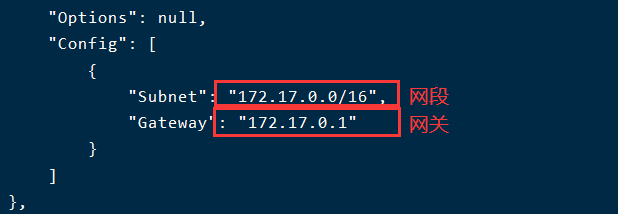


### 探究

tomcat3到底是以何种方式与tomcat2相连的？

```shell
[root@VM-0-14-centos ~]# docker exec -it tomcat3 cat /etc/hosts
127.0.0.1       localhost
::1     localhost ip6-localhost ip6-loopback
fe00::0 ip6-localnet
ff00::0 ip6-mcastprefix
ff02::1 ip6-allnodes
ff02::2 ip6-allrouters
#看这行
172.17.0.3      tomcat02 6d841f8f494a
172.17.0.4      10702cb4bda7
```

可以看到在tomcat3的host文件中直接把tomcat2的转发写死在host中了

**--link其实就是在hosts配置中增加了一个tomcat2的映射(或者叫路由？)**

```shell
[root@VM-0-14-centos ~]# docker exec -it tomcat02 cat /etc/hosts
127.0.0.1       localhost
::1     localhost ip6-localhost ip6-loopback
fe00::0 ip6-localnet
ff00::0 ip6-mcastprefix
ff02::1 ip6-allnodes
ff02::2 ip6-allrouters
172.17.0.3      6d841f8f494a
#在tomcat02中是看不到tomcat03这条映射的 因为我们在创建的时候没有--link tomcat03
```

现在的docker开发中**不建议**使用--link了，因为直接写在host中太笨重了。

我们需要自定义网络，而不是通过docker0转发！

**docker0的问题：**不支持容器名连接访问


### 自定义网络(容器互联)


```shell
[root@VM-0-14-centos ~]# docker network --help 

Usage:  docker network COMMAND

Manage networks

Options:


Commands:
  connect     Connect a container to a network
  create      Create a network
  disconnect  Disconnect a container from a network
  inspect     Display detailed information on one or more networks
  ls          List networks
  prune       Remove all unused networks
  rm          Remove one or more networks

Run 'docker network COMMAND --help' for more information on a command.

```

**网络模式：**

bridge：桥接模式（默认）自己创建也是使用桥接模式

none：不配置网络

host：主机模式 和宿主机共享网络

container：和容器内网络连通（用的少）容器之间直接互联 但局限很大

**测试**

```shell
[root@VM-0-14-centos ~]# docker run -d -P --name tomcat01 --net bridge tomcat
```

这个命令和我们之前启动的是一样的，因为默认就是 --net bridge 也就是docker0

docker0特点：

- 默认
- 域名不能访问
- --link可以打通连接


### 自定义网络

```shell
[root@VM-0-14-centos ~]# docker network create --help

Usage:  docker network create [OPTIONS] NETWORK

Create a network

Options:
      --attachable           Enable manual container attachment
      --aux-address map      Auxiliary IPv4 or IPv6 addresses used by Network driver (default
                             map[])
      --config-from string   The network from which copying the configuration
      --config-only          Create a configuration only network
  -d, --driver string        Driver to manage the Network (default "bridge")
      --gateway strings      IPv4 or IPv6 Gateway for the master subnet
      --ingress              Create swarm routing-mesh network
      --internal             Restrict external access to the network
      --ip-range strings     Allocate container ip from a sub-range
      --ipam-driver string   IP Address Management Driver (default "default")
      --ipam-opt map         Set IPAM driver specific options (default map[])
      --ipv6                 Enable IPv6 networking
      --label list           Set metadata on a network
  -o, --opt map              Set driver specific options (default map[])
      --scope string         Control the network's scope
      --subnet strings       Subnet in CIDR format that represents a network segment

```


```shell
[root@VM-0-14-centos ~]# docker network create -d bridge --subnet 192.168.0.0/16 --gateway 192.168.0.1 mynet
edc68cd6b4a1eba9c544b9f719b31783f3d50c099e6b9fd3b4491487e7b5cba9
# -d bridge
# --subnet 192.168.0.0/16  子网
# --gateway 192.168.0.1    网关

[root@VM-0-14-centos ~]# docker network ls
NETWORK ID          NAME                DRIVER              SCOPE
71d17c91aea2        bridge              bridge              local
3eb81acfc887        host                host                local
edc68cd6b4a1        mynet               bridge              local
3fcb64271f15        none                null                local

[root@VM-0-14-centos ~]# docker network inspect mynet
[
    {
        "Name": "mynet",
        "Id": "edc68cd6b4a1eba9c544b9f719b31783f3d50c099e6b9fd3b4491487e7b5cba9",
        "Created": "2020-11-13T14:56:17.803238411+08:00",
        "Scope": "local",
        "Driver": "bridge",
        "EnableIPv6": false,
        "IPAM": {
            "Driver": "default",
            "Options": {},
            "Config": [
                {
                    "Subnet": "192.168.0.0/16",
                    "Gateway": "192.168.0.1"
                }
            ]
        },
        "Internal": false,
        "Attachable": false,
        "Ingress": false,
        "ConfigFrom": {
            "Network": ""
        },
        "ConfigOnly": false,
        "Containers": {},
        "Options": {},
        "Labels": {}
    }
]

```

我们自己的网络这就创建好了，接下来怎么使用呢？

```shell
[root@VM-0-14-centos ~]# docker run -d -P --name tomcat-mynet-01 --net mynet tomcat
a8c950d9540cd84c194ccd0080ab0493b89cbbfbcf2f7a1cda2d64a3d3ef94bc
[root@VM-0-14-centos ~]# docker run -d -P --name tomcat-mynet-02 --net mynet tomcat
c0d893ae5233f7fbdb1a13e8c04927266dfff66a9f6e8af4ff1f216db1345572


[root@VM-0-14-centos ~]# docker network inspect mynet

```


现在直接ping 02的IP也是可以的，直接ping 02的容器名也是可以的！

现在就不需要--link来连接了。我们自定义的网络docker都已经帮我们维护好了对应的关系。


**好处**：不同的集群使用不同的网络，保证集群的安全和健康


### 网络的连通

核心命令：


搭建环境：

```shell
[root@VM-0-14-centos ~]# docker ps
CONTAINER ID        IMAGE               COMMAND             CREATED             STATUS              PORTS                     NAMES
f941cb169b06        tomcat              "catalina.sh run"   3 seconds ago       Up 2 seconds        0.0.0.0:32778->8080/tcp   tomcat02
954303276a38        tomcat              "catalina.sh run"   8 seconds ago       Up 7 seconds        0.0.0.0:32777->8080/tcp   tomcat01
c0d893ae5233        tomcat              "catalina.sh run"   16 minutes ago      Up 16 minutes       0.0.0.0:32776->8080/tcp   tomcat-mynet-02
a8c950d9540c        tomcat              "catalina.sh run"   16 minutes ago      Up 16 minutes       0.0.0.0:32775->8080/tcp   tomcat-mynet-01

```

其中tomcat01 02是默认的docker0网络

tomcat-mynet-01 tomcat-mynet-02使用mynet网络

他们现在毫无疑问是不能ping通的

所以我们需要：


**测试**

```shell
[root@VM-0-14-centos ~]# docker network connect mynet tomcat01
[root@VM-0-14-centos ~]# docker network inspect mynet 
```


可以看到tomcat01被添加进mynet网络中了

**一个容器两个ip地址**

```shell
[root@VM-0-14-centos ~]# docker inspect tomcat01
```


同一个网络下自然也是可以ping通的


tomcat02没有被添加到mynet中自然也就ping不通 tomcat-mynet-0X 了


**结论**

假设要跨网络操作别人，就需要使用docker network connect 连通！


### 实战：部署Redis集群

```shell
[root@VM-0-14-centos ~]# docker network create redis --subnet 172.38.0.0/16

#脚本创建节点
for port in $(seq 1 6);\
do \
mkdir -p /mydata/redis/node-${port}/conf
touch /mydata/redis/node-${port}/conf/redis.conf
cat << EOF >/mydata/redis/node-${port}/conf/redis.conf
port 6379
bind 0.0.0.0
cluster-enabled yes
cluster-config-file nodes.conf
cluster-node-timeout 5000
cluster-announce-ip 172.38.0.1${port}
cluster-announce-port 6379
cluster-announce-bus-port 16379
appendonly yes
EOF
done

#启动docker
docker run -p 637${port}:6379 -p 1637${port}:16379 --name redis-${port} \
-v /mydata/redis/node-${port}/data:/data \
-v /mydata/redis/node-${port}/conf/redis.conf:/etc/redis/redis.conf \
-d --net redis --ip 172.38.0.1${port} redis:5.0.9-alpine3.11 redis-server /etc/redis/redis.conf;\


docker run -p 6371:6379 -p 16371:16379 --name redis-1 \
-v/mydata/redis/node-1/data:/data \
-v/mydata/redis/node-1/conf/redis.conf:/etc/redis/redis.conf \
-d --net redis --ip 172.38.0.11 redis:5.0.9-alpine3.11 redis-server /etc/redis/redis.conf

docker run -p 6376:6379 -p 16376:16379 --name redis-6 \
-v/mydata/redis/node-6/data:/data \
-v/mydata/redis/node-6/conf/redis.conf:/etc/redis/redis.conf \
-d --net redis --ip 172.38.0.16 redis:5.0.9-alpine3.11 redis-server /etc/redis/redis.conf

[以下略]

#创建集群
docker exec -it redis-1 /bin/sh

redis-cli --cluster create 172.38.0.11:6379 172.38.0.12:6379 172.38.0.13:6379 172.38.0.14:6379 172.38.0.15:6379 172.38.0.16:6379 --cluster-replicas 1
[输入yes]
>>> Nodes configuration updated
>>> Assign a different config epoch to each node
>>> Sending CLUSTER MEET messages to join the cluster
Waiting for the cluster to join
...
>>> Performing Cluster Check (using node 172.38.0.11:6379)
M: 0494c7fc196e804e88409386602bca669dd76e77 172.38.0.11:6379
   slots:[0-5460] (5461 slots) master
   1 additional replica(s)
S: a5841960b0145889274896a5c8fa3658ffb76ef6 172.38.0.14:6379
   slots: (0 slots) slave
   replicates 66a6dda66be2f49125f82c0d41832ba8ae1c79bc
M: 60f488092edf13f75eef2f0a349481cad972640c 172.38.0.12:6379
   slots:[5461-10922] (5462 slots) master
   1 additional replica(s)
S: 0f1a400e07e6f1bdf25014cee16b6bd426fffa60 172.38.0.15:6379
   slots: (0 slots) slave
   replicates 0494c7fc196e804e88409386602bca669dd76e77
S: 8072adbda00933f1bf44c30d81de4866d3f7be1a 172.38.0.16:6379
   slots: (0 slots) slave
   replicates 60f488092edf13f75eef2f0a349481cad972640c
M: 66a6dda66be2f49125f82c0d41832ba8ae1c79bc 172.38.0.13:6379
   slots:[10923-16383] (5461 slots) master
   1 additional replica(s)
[OK] All nodes agree about slots configuration.
>>> Check for open slots...
>>> Check slots coverage...
[OK] All 16384 slots covered.

#查看集群信息
/data # redis-cli -c
127.0.0.1:6379> cluster info
cluster_state:ok
cluster_slots_assigned:16384
cluster_slots_ok:16384
cluster_slots_pfail:0
cluster_slots_fail:0
cluster_known_nodes:6
cluster_size:3
cluster_current_epoch:6
cluster_my_epoch:1
cluster_stats_messages_ping_sent:330
cluster_stats_messages_pong_sent:333
cluster_stats_messages_sent:663
cluster_stats_messages_ping_received:328
cluster_stats_messages_pong_received:330
cluster_stats_messages_meet_received:5
cluster_stats_messages_received:663
127.0.0.1:6379> cluster nodes
a5841960b0145889274896a5c8fa3658ffb76ef6 172.38.0.14:6379@16379 slave 66a6dda66be2f49125f82c0d41832ba8ae1c79bc 0 1605261451523 4 connected
60f488092edf13f75eef2f0a349481cad972640c 172.38.0.12:6379@16379 master - 0 1605261450523 2 connected 5461-10922
0f1a400e07e6f1bdf25014cee16b6bd426fffa60 172.38.0.15:6379@16379 slave 0494c7fc196e804e88409386602bca669dd76e77 0 1605261451723 5 connected
8072adbda00933f1bf44c30d81de4866d3f7be1a 172.38.0.16:6379@16379 slave 60f488092edf13f75eef2f0a349481cad972640c 0 1605261449721 6 connected
0494c7fc196e804e88409386602bca669dd76e77 172.38.0.11:6379@16379 myself,master - 0 1605261450000 1 connected 0-5460
66a6dda66be2f49125f82c0d41832ba8ae1c79bc 172.38.0.13:6379@16379 master - 0 1605261450722 3 connected 10923-16383


127.0.0.1:6379> set a b
-> Redirected to slot [15495] located at 172.38.0.13:6379
OK
#可以看到他放在了3号机上，这时我们停掉3号的容器，应该会在3号的从机里面应该也有这个值
[root@VM-0-14-centos ~]# docker stop redis-3
127.0.0.1:6379> get a
-> Redirected to slot [15495] located at 172.38.0.14:6379
"b"
```


## Docker工程交付

**大致流程：**

1. 开发完代码
2. 编写DockerFile
3. docker build
4. docker run


## Docker Compose

### 简介

非常多的容器要启动的情况下，不可能手动启停。

Docker Compose 来轻松高效管理容器，定义多个容器的运行。

官方介绍：

> Compose is a tool for defining and running multi-container Docker applications. With Compose, you use a YAML file to configure your application’s services. Then, with a single command, you create and start all the services from your configuration. To learn more about all the features of Compose, see [the list of features](https://docs.docker.com/compose/#features).
>
> Compose works in all environments: production, staging, development, testing, as well as CI workflows. You can learn more about each case in [Common Use Cases](https://docs.docker.com/compose/#common-use-cases).
>
> Using Compose is basically a three-step process:
>
> 1. Define your app’s environment with a `Dockerfile` so it can be reproduced anywhere.
> 2. Define the services that make up your app in `docker-compose.yml` so they can be run together in an isolated environment.
> 3. Run `docker-compose up` and Compose starts and runs your entire app.

从上文可知：

- 我们需要dockerfile来运行每个容器
- 需要有一个服务（？）
- 通过`docker-compose.yml`文件管理
- 使用`docker-compose up`启动项目


docker compose是docker官方开源的一个项目，需要安装


`docker-compose.yml`文档怎么写？

A `docker-compose.yml` looks like this:

```yaml
version: "3.8"
services:            #服务
  web:				#web服务
    build: .
    ports:
      - "5000:5000"
    volumes:
      - .:/code
      - logvolume01:/var/log
    links:			#连接redis
      - redis
  redis:			#redis服务
    image: redis
volumes:		#挂载
  logvolume01: {}
```

docker-compose up 可以一次启动n个服务

Compose重要概念

- 服务services，容器，应用（web、redis、mysql。。。）。
- 项目project 一组关联的容器。


### 安装Compose

打开：https://docs.docker.com/compose/install/

1、下载

```shell
#官方的 比较慢
sudo curl -L "https://github.com/docker/compose/releases/download/1.27.4/docker-compose-$(uname -s)-$(uname -m)" -o /usr/local/bin/docker-compose

#国内的 可能快点
curl -L https://get.daocloud.io/docker/compose/releases/download/1.27.4/docker-compose-'uname -s'-'uname -m' > /usr/local/bin/docker-compose
```

2、给权限

```shell
sudo chmod +x /usr/local/bin/docker-compose
```


### 体验

https://docs.docker.com/compose/gettingstarted/

创建文件夹

```shell
$ mkdir composetest
$ cd composetest
```

创建`app.py`文件

```python
import time

import redis
from flask import Flask

app = Flask(__name__)
cache = redis.Redis(host='redis', port=6379)

def get_hit_count():
    retries = 5
    while True:
        try:
            return cache.incr('hits')
        except redis.exceptions.ConnectionError as exc:
            if retries == 0:
                raise exc
            retries -= 1
            time.sleep(0.5)

@app.route('/')
def hello():
    count = get_hit_count()
    return 'Hello World! I have been seen {} times.\n'.format(count)
```

创建`requirements.txt`

```
flask
redis
```

创建`Dockerfile`

```dockerfile
FROM python:3.7-alpine
WORKDIR /code
ENV FLASK_APP=app.py
ENV FLASK_RUN_HOST=0.0.0.0
RUN apk add --no-cache gcc musl-dev linux-headers
COPY requirements.txt requirements.txt
RUN pip install -r requirements.txt
EXPOSE 5000
COPY . .
CMD ["flask", "run"]
```

> This tells Docker to:
>
> - Build an image starting with the Python 3.7 image.
> - Set the working directory to `/code`.
> - Set environment variables used by the `flask` command.
> - Install gcc and other dependencies
> - Copy `requirements.txt` and install the Python dependencies.
> - Add metadata to the image to describe that the container is listening on port 5000
> - Copy the current directory `.` in the project to the workdir `.` in the image.
> - Set the default command for the container to `flask run`.
>
> For more information on how to write Dockerfiles, see the [Docker user guide](https://docs.docker.com/develop/) and the [Dockerfile reference](https://docs.docker.com/engine/reference/builder/).

创建`docker-compose.yml`

```yaml
version: "3.8"
services:
  web:
    build: .
    ports:
      - "5000:5000"
  redis:
    image: "redis:alpine"
```

build 然后 run 这个应用

```shell
$ docker-compose up
# docker-compose up --build #会重新build项目
```

因为docker compose会在创建的时候自动把应用归属到同一个网络中，所以我们可以直接使用域名访问


**docker compose启动流程**

创建网络

执行yaml文件

启动服务


### yaml规则

docker-compose.yaml 是集群的核心

https://docs.docker.com/compose/compose-file/

它可以看作是分成3层

```yaml

version:"" #版本

service:   #服务
	服务1:web
        #服务配置
        images
        build
        network
        ······
    
	服务2:redis
		······
		
	······
	
#其他配置  网络、卷挂载、全局规则
Volumes:
networks:
configs:

```


## Docker Swarm

集群方式部署

命令自行--help查看

无力购买4台服务器测试截图

启动一个swarm服务

docker swarm init

主要实现动态扩缩容 docker swarm scale 服务名=num

和区分管理者和工作者的概念

以及raft协议

可以直接学习k8s

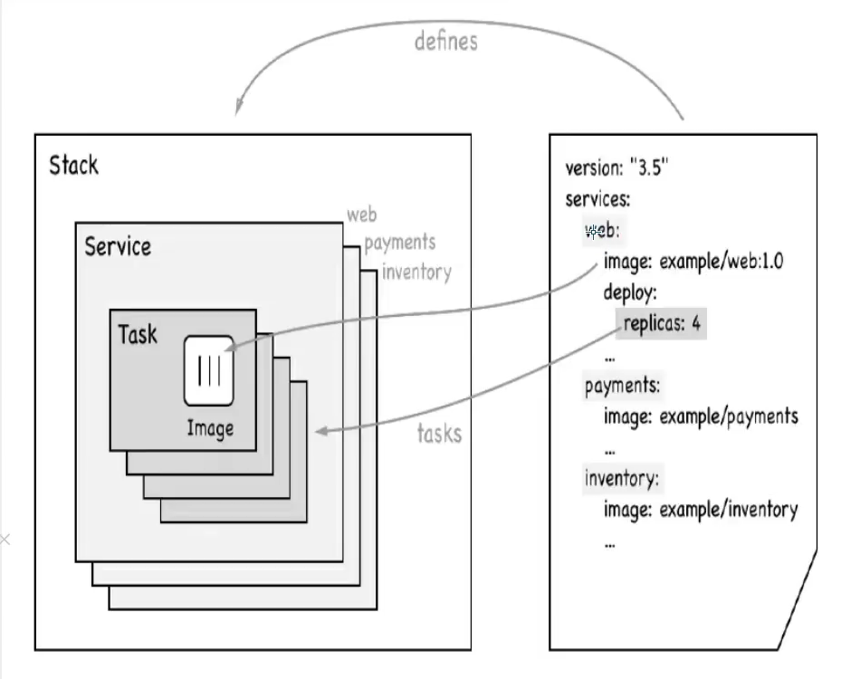

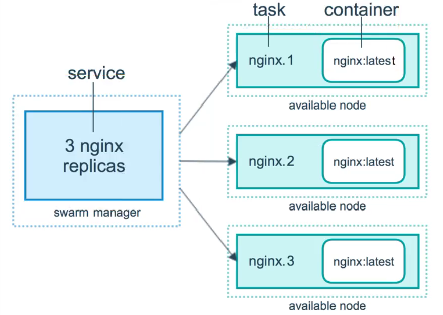

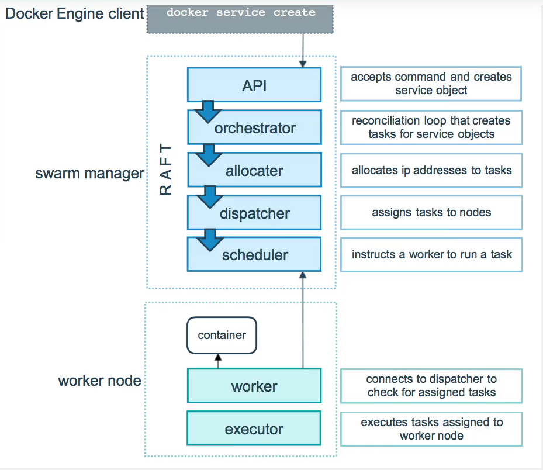


**swarm**

集群的管理和编排，docker可以初始化一个swarm集群，其他节点可以加入

**node**

就是一个docker节点，多个节点就是一个网络集群

**service**

任务，可以在管理节点或者工作节点运行

**task**

容器内的命令，细节任务


**Swarm网络**

overlay

ingress：特殊的overlay，具有负载均衡 ipvs vip

虽然docker在4台机器上，实际是同一个网络


## Docker Stack

docker-compose 单机部署项目

Docker stack 集群部署

```shell
#单机
docker-compose up -d wordpress.yml

#集群
docker stack depoly wordpress.yml

#docker-compose 文件主要核心在于deploy项
```


## Docker Secret

安全，配置密码，证书之类的、


## CI\CD Jenkins